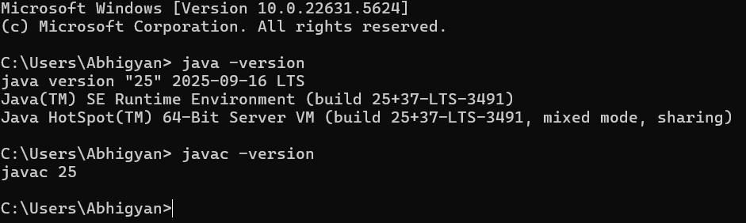

# Campus Course Records Manager (CCRM)

A comprehensive Java console application for managing campus courses, student enrollments, grades, and records with full file I/O operations.

## Project Overview

CCRM is a **Java SE console application** that demonstrates advanced Java programming concepts including OOP principles, design patterns, Stream API, NIO.2 file operations, and modern Java features.

**Key Features:**
- Student and Course management
- Enrollment system with business rules
- Grade recording and GPA calculation
- CSV import/export functionality
- Backup system with recursive utilities
- Comprehensive reporting

##  How to Run

### Prerequisites
- **JDK 17+** (Recommended: OpenJDK 17 or Oracle JDK 17)
- **VS Code** with Java Extension Pack
- Git (for version control)

### Installation & Execution
```bash

# Clone the repository
git clone https://github.com/abhigyansinha95/CampusCourseRecordsManager.git
cd CampusCourseRecordsManager

# Open in VS Code
code .

# Compile and run from VS Code terminal
cd src
javac edu\ccrm\io\*.java edu\ccrm\cli\*.java edu\ccrm\config\*.java
java edu.ccrm.cli.Main
```
### Evolution of Java

1995: Java 1.0 released - "Write Once, Run Anywhere"

1997: Java 1.1 - Inner classes, JDBC

2004: Java 5 - Generics, Enums, Autoboxing

2014: Java 8 - Lambdas, Stream API, Date/Time API

2017: Java 9 - Module system, JShell

2021: Java 17 (LTS) - Sealed classes, pattern matching

2023: Java 21 (LTS) - Virtual threads, pattern matching enhancements

### Java  Platform Comparison
Aspect	       Java ME           Java SE              Java EE
Target	       Mobile devices	 Desktop apps	       Enterprise systems
Scope	       Limited API	     Standard library	   Extended enterprise
Use Case	   Embedded systems  Standalone apps       Web applications
This Project   Doesnt Support    Supports              Doesnt Suports

### Java Architecture

JDK (Java Development Kit) – Tools + Compiler + JRE (for development).

JRE (Java Runtime Environment) – JVM + libraries (to run Java apps).

JVM (Java Virtual Machine) – Executes bytecode into machine code.

### Windows Installation Steps

# Step 1: Download JDK

Visit Oracle JDK Downloads

Download JDK 25 for Windows x64

Run the installer

# Step 2: Set Environment Variables

Right-click This PC → Properties → Advanced system settings

Click Environment Variables

Under System variables:

Create JAVA_HOME = C:\Program Files\Java\jdk-25\bin

Edit Path → Add %JAVA_HOME%\bin

# Step 3:Verify Installation



### VS Code Setup

# Step 1: Install VS Code Extensions

1. Open VS Code

2. Go to Extensions (Ctrl+Shift+X)

3. Search and install:

    Extension Pack for Java (by Microsoft)

    Project Manager for Java

    Debugger for Java

# Step 2: Open Project in VS Code
```bash

# Clone the repository
git clone https://github.com/abhigyansinha95/CampusCourseRecordsManager.git
cd CampusCourseRecordsManager
code .
```
# Step 3: Configure Java Runtime

1. Ctrl+Shift+P → "Java: Configure Java Runtime"

2. Select JDK 17+ as the runtime

3. VS Code will automatically detect the project structure

# Step 4: Running the Application
```bash
# Compile and run from VS Code terminal
cd src
javac edu\ccrm\io\*.java edu\ccrm\cli\*.java edu\ccrm\config\*.java
java edu.ccrm.cli.Main
```

### VS Code Structure


### Requirements Mapping Table

Syllabus Topic	                          File/Class/Method	                            Demonstration
OOP Pillars	                              Person.java, Student.java	                    Inheritance, Encapsulation, Polymorphism
Abstract Classes	                      Person.java	                                Abstract methods and classes
Interfaces	                              Searchable.java	                            Functional interface implementation
Enums	                                  Semester.java, Grade.java	                    Enum with constructors and methods
Design Patterns	                          AppConfig.java, Course.java	                Singleton and Builder patterns
Stream API	                              StudentService.java, CourseService.java	    Filtering, mapping, collection operations
Lambda Expressions	                      CLIMenu.java                                  search functionality	Functional programming
Exception Handling	                      DuplicateEnrollmentException.java	            Custom exceptions, try-catch blocks
NIO.2 File Operations	                  ImportExportService.java	                    Files.lines(), Path operations
Recursion	                              BackupService.java calculateDirectorySize()	Recursive file system traversal
Date/Time API	                          Enrollment.java	                            LocalDateTime usage
Switch Statements	                      CLIMenu.java	                                Traditional and enhanced switch
Loops	                                  CLIMenu.java	                                while, do-while, for, enhanced for
Jump Controls	                          CLIMenu.java	                                break, continue, labeled jumps

### Enabling Assertions
```bash
javac edu\ccrm\io\*.java edu\ccrm\cli\*.java edu\ccrm\config\*.java
java -ea edu.ccrm.cli.Main
```
### Project Working Example


### Backup running


This project is for educational purposes as part of academic coursework.

Developed by: Abhigyan Sinha
Course: Programming in Java
Institution: VIT Bhopal University

